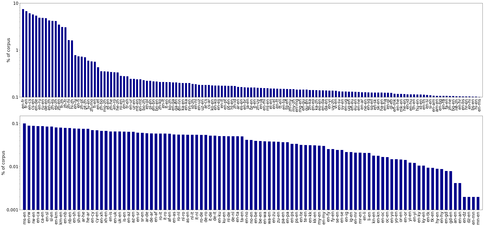
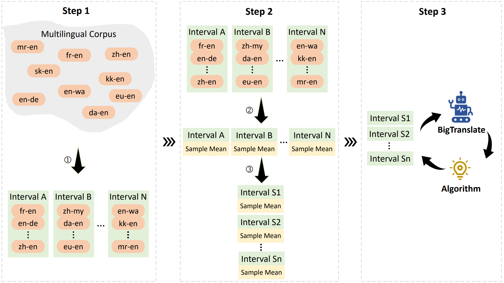
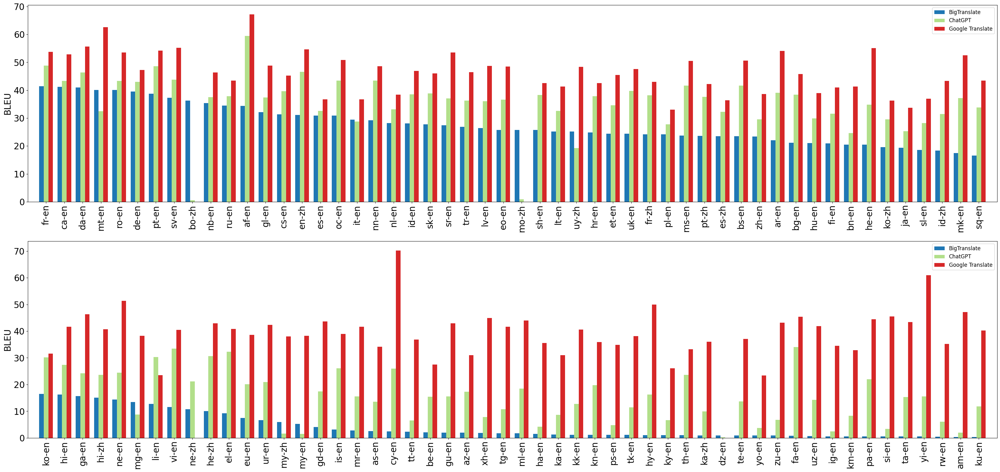
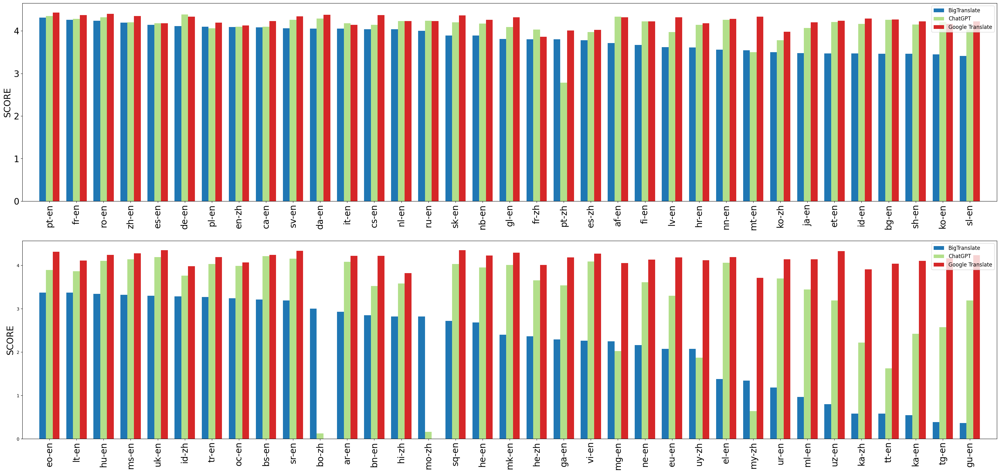

# 🦙  **BigTrans**  🚀
## 💥 News
**[May 31, 2023] We have released BigTrans model on [Hugging Face](https://huggingface.co/James-WYang/BigTrans) for download and experience!**


## ⭐ BigTrans Construction
### 🌓 Large-scale Parallel Dataset Construction
In order to enhance the language capabilities of the Chinese LLaMA model to support 102 languages, we constructed a comprehensive parallel corpus dataset consisting of 102 languages. This dataset was employed to continue training the foundational model. The compilation of this dataset drew upon multiple sources, including widely available public parallel corpus datasets and household datasets. The public datasets utilized in our study contain IWSLT, WMT, CCMT, and OPUS-100, forming the initial corpus of our dataset.

To effectively illustrate the distribution of the corpus, we present a visual representation of the language-pair distribution within the multilingual datasets. The matter pertaining to the imbalance between high-resource and low-resource language pairs continues to be a prominent concern within the current corpus.



### 🌔 Incremental Multilingual Pre-training
In this incremental pre-training method, we gradually expose the model to language pairs in a curriculum-like manner. Initially, the model is exposed to high-resource language pairs, allowing it to establish a solid foundation in those languages. Subsequently, we progressively introduce low-resource language pairs, enabling the model to gradually expand its knowledge and proficiency in these languages.

Specifically, we follow a three-step approach in our incremental pre-training method. Firstly, we set the sample interval size and divide language pairs into distinct intervals based on the number of instances for each language pair. Secondly, we calculate the sample mean for all language pairs in each interval. Thirdly, we dynamically measure the moment of adding the language-pair samples next interval according to the sample mean in the previous sample interval. In the following part, we detail the three steps.



## 🌟 Experiments
### 🌖 Automatic Evaluation with BLEU
An illustrated comparison of 102 languages from X to English or Chinese between BigTrans, ChatGPT and Google Translate. We sort the language scores in BLEU for BigTrans in descending order.



### 🌗 Automatic Evaluation with GPT-4
An illustrated comparison of 70 languages from X to English or Chinese between BigTrans, ChatGPT and Google Translate. We sort the language scores in GPT-4 score for BigTrans in descending order.



##  🤖 BigTrans Model

### ⚠️ User Notice (Must Read)

<!-- The official [LLaMA models released by Facebook prohibit commercial use](https://github.com/facebookresearch/llama), and the official model weights have not been open-sourced (although there are many third-party download links available online). -->

The BigTrans Model weights are based on [GNU General Public License v3.0](https://www.gnu.org/licenses/gpl-3.0.html) protocols, which is only for research use and cannot be used for commercial purposes. 

***Please confirm that you are using the model in this warehouse with [permission](https://docs.google.com/forms/d/e/1FAIpQLSfqNECQnMkycAp2jP4Z9TFX0cGR4uf7b_fBxjY_OjhJILlKGA/viewform?usp=send_form).***

### 📎 Model Download

**BigTrans**：[Hugging Face](https://huggingface.co/James-WYang/BigTrans) 
<!-- [Google Drive](https://drive.google.com/drive/folders/1r_X7sehOZ1g_an26EziuOrf7G8Q0DjB_?usp=drive_link) -->

<!-- > ⏳ Model is uploading -->

### 📌 Model Inference
Install dependencies:

   ```bash
   pip install -r requirements.txt
   ```

Example usage:

  ```bash
  python -u model/inference.py \
    --model ${CHECKPOINT_PATH} \
    --tokenizer-path ${TOKENIZER_PATH} \
    --prompt-file ${PROMPT_FILE} \
    --with-instruct \
    --out-file ${LOW_OUT_FILE} \
    --seed ${SEED} \
    --beam-search \
    --num-beams ${NUM_BEAMS} \
    --times ${OUT_TIME} \
    --max-tokens ${MAX_TOKENS} \
    --no-repeat-ngram-size ${NO_REPEAT_NGRAM_SIZE} \
    --top-k ${TOP_K} \
    --top-p ${TOP_P} \
    --temperature ${TEMPERATURE} 2>&1 >>${LOG_FILE}
  ```
We can customize the hyperparameters:

  ```bash
  python -u model/inference.py \
    --model ${CHECKPOINT_PATH} \
    --tokenizer-path ${TOKENIZER_PATH} \
    --prompt-file ${PROMPT_FILE} \
    --with-instruct \
    --out-file ${BEAM_OUT_FILE} \
    --seed ${SEED} \
    --beam-search \
    --num-beams 5 \
    --times 1 \
    --max-tokens 256 \
    --no-repeat-ngram-size 6 2>&1 >>${LOG_FILE}
  ```

## License

Our code and documents are released under Apache Licence 2.0

Following LLaMA, our pre-trained weights are released under GNU General Public License v3.0

## Acknowledgement

We thank all contributors for BigTrans projects.

This repo benefits from [LLaMA](https://github.com/facebookresearch/llama), [Stanford Alpaca](https://github.com/tatsu-lab/stanford_alpaca). Thanks for their wonderful works.

## Contact

If you have any questions, please feel free to contact us by sending an email to {yangwen2023, lichong2021}@ia.ac.cn, {jjzhang, cqzong}@nlpr.ia.ac.cn .

## Citation

```
@article{yang-etal-2023-BigTrans,
  author    = {Wen Yang and
               Chong Li and
               Jiajun Zhang and
               Chengqing Zong},
  title={BigTrans: Augmenting Large Language Models with Multilingual Translation Capability over 100 Languages},
  journal={arXiv preprint arXiv:2305.18098},
  url={https://arxiv.org/abs/2305.18098},
  year={2023}
}
```


